# freeTypora

---

Using Typora for free.

---

## 0 太长不看版

+ 注意， 本方法只对 `1.0` 之前版本有效（当然， `1.0.x` 之后的几个小版本可能也有效，没有验证过），原理是修改注册时间，绕过验证。不是为了真正破解 `typora` 的 `1.0` 之后的收费版本。毕竟作者要恰饭的，我们只是使用一下作者之前不收费的版本。
+ `TYPORA_PATH` 是 `typora` 的安装路径。
+ 已破解的文件是基于 `typora-0.11.17` 版本。

去我的 `github`，下载项目，把 `build/dec_app` 放到 `TYPORA_PATH/resources/` 下，重命名为 `app` 即可。

---

## 1 前言

`typora` 是一款非常好用的 `markdown` 编辑器。

作者在 `1.0` 发布后的版本开始收费了，不过对于以前的 `0.` 开头的不收费版本在短时间内也没有禁止使用，只是会提醒需要 `purchase`.

甚至如下图所见，有些 `1.0` 之后的版本也可以不用 `purchase`使用， 我之前在 `ubuntu 20.04` 上安装的 `typora 1.1.5`  也只是提醒，你选择 `Not Now` 之后还是可以继续使用的。

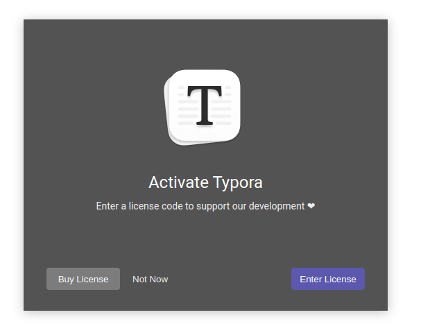

但是这可能是个例，我在 `windows 10` 上的 `typora 1.1.5` 并不可以使用。

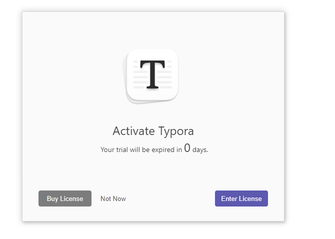

而且，我试着使用 `1.0` 之前的版本（官网上已经没有 `1.0` 之前版本的安装包了，从其他途径找到了 `0.11.17` 的），一段时间内是没有过期问题的。

但是前段时间也突然提示我过期，而且是彻底打不开 `typora`，直接跳转到 `typora` 官网。

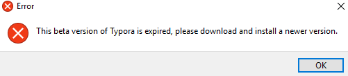

无奈之下，我只好选择 [`marktext`](https://github.com/marktext/marktext)，这是另一款开源免费的 `typora` 编辑器。

但是！实在是用不惯，界面设计也不是很喜欢，总感觉没有 `typora` 简洁顺手。

所以，所以，虽然我不喜欢使用破解的软件， 也尝试着去寻找解决方案。

下面给出破解 `typora` 的方法。

---

## 2 原理

网络上有一些破解方法，比如法海提供的 `windows` 下的[破解补丁](https://www.fahai.org/index.php/archives/1/)，或者是 `sunfishi` 的[破解方式]()。

研究了一下他们的方法，  `windows` 下的破解补丁并不知道是怎么得到的， 感觉不太放心。（这方面有点技术洁癖在的。。。）

而 `sunfish` 给了他的破解思路， 同时提供了他的加密解密工具源码， 所以在阅读工具源码之后， 可以放心进行破解， 同时这个方法是全平台通用的。

[Mas0nShi---TyporaCracker](https://github.com/Mas0nShi/typoraCracker)

这是作者原仓库的地址， 现在已经被封掉了。（吐槽一句， 自从微软收购  `github` 之后， `github` 也没有那么的 `开源` 了， 很多仓库会受到管制）

当然， 还是有部分人备份了下来的， 目前我备份到了[我的仓库](https://github.com/chenxygh/freeTypora)

具体解密原理可以阅读 `sunfishi` 的[博客](https://bbs.pediy.com/thread-270534.htm)。

---

## 3 破解

> 环境准备：python + nodejs，操作系统无关，以下操作在 ubuntu20.04 上进行。
>
> typora 版本：下面的教程使用的是 typora-0.11.17

大致流程就是， 通过 `sunfishi` 提供的解密工具， 对 `typora` 关键文件进行解压解密， 然后阅读解密后的 `typora` 源码， 研究验证机理， 修改注册时间， 以使 `typora` 不再过期。

---

#### 3.1. 下载 typora crack 代码

`git clone git@github.com:chenxygh/freeTypora.git`

（或者， 直接网页上[下载 zip 包](https://github.com/chenxygh/freeTypora)）

`typoraCrack`  是用来加密解密`typora` 相关文件的工具。

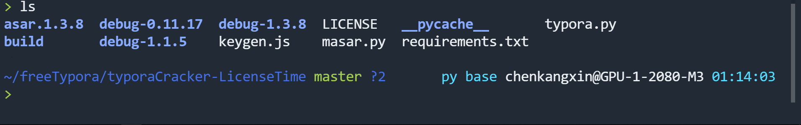

图里文件很多， 这是整理之前的截图， 很多文件是我在实验过程中生成的。

主要就以下几个文件：

`typora.py` ，这是主模块，具体实现可以查看源码。

`masar.py` 是加密/解密模块， 实际上的 `typora` 的相关文件代码是经过处理的加密乱码形式的， 通过这个模块进行加密或者解密操作。当然， `ubuntu` 也可以通过 `npm` 安装 `asar` 进行加密解密。（`sudo npm install -g asar`）

`requirements.txt`， 不用多说， 一些必要模块， 通过 `pip` 进行安装。

`keygen.js` 是另外的方法会用到的 `js` 文件。

---

#### 3.2. 安装相关依赖

`pip install -r requirements.txt `

---

#### 3.3. 解密 typora 相关文件

下面这条指令要求在 `TYPORA_PATH/resources` 下执行。(`TYPORA_PATH` 之前有讲， 是 `typora` 的安装路径)

`python typora.py app.asar .`

直接执行， 会发现当前目录下多了 `dec_app` 和 `tmp_app` 两个文件夹。

---

解释一下指令，`python typora.py -h` 可以看到：

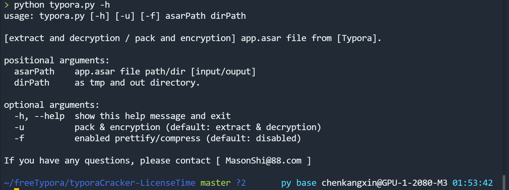

所以指令的第一个参数是 `asarPath`， 即 `asar` 文件所在路径；第二个参数是 `dirPath`， 即解密过程生成文件存放路径， 查看源码可知， 这个参数如果是不存在的，那么会自动创建同名的文件夹。

所以， 我一般更加倾向于下面的做法：

`python typora.py debug-0.11.17/app.asar build`

`debug-0.11.17` 是我自己所创建的文件夹， 里面的文件有：

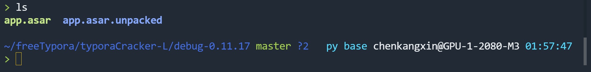

这里的 `app.asar` 和 `app.asar.unpacked` 是 `TYPORA_PATH/resources`下的。

即， 我先复制 `app.asar` 和 `app.asar.unpacked` 这两个文件到 `typora.py` 路径下的文件夹 `debug-0.11.17` 里。

注意， 虽然指令看起来只用到了 `app.asar` 文件， 但是如果你的`asarPath` 下面没有  `app.asar.unpacked` 文件的话， 会出现下面的情况：

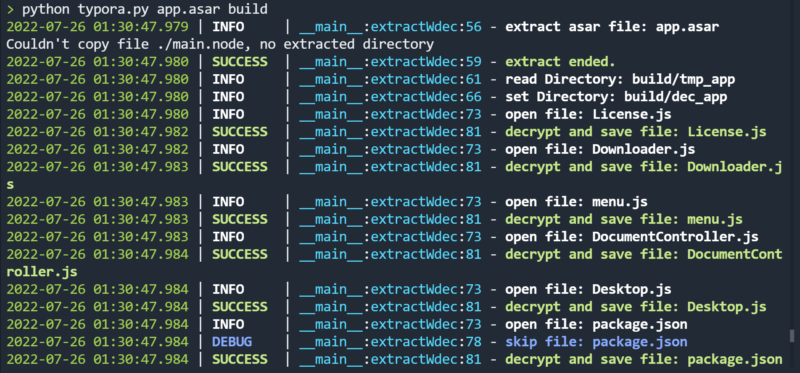

可以看到， 提示第二行， 报没有 `main.node`  相关的文件夹。 实际上 `main.node` 文件就在`app.asar.unpacked` 里。

这里当初我也是研究了一段时间， 才解决的 `bug`

当然， 如果你一开始就是在 `TYPORA_PATH`下运行的， 那么就不会出现这样的问题。

---

如果没有`build` 文件夹， 那么就会新建。

下面是指令执行过程。

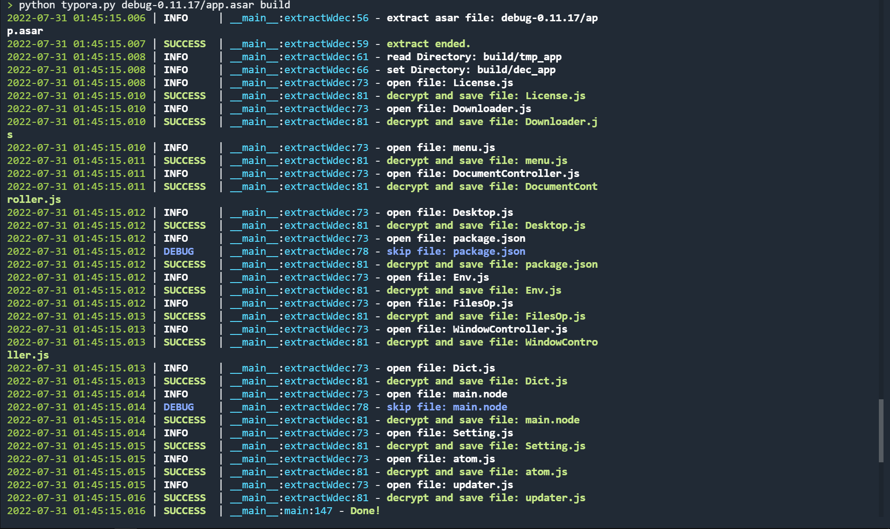

可以看到， 解压解密文件成功。

---

#### 3.4. 阅读 typora 授权源码， 修改注册时间

进入 `build` 文件夹， 可以看到 `dec_app` 和 `tmp_app` 两个文件夹。（如果第三步直接在 `TYPORA_PATH/resources` 下执行的， 生成目录是 `.`  ,  那么这两个文件夹就在`TYPORA_PATH/resources` 下）

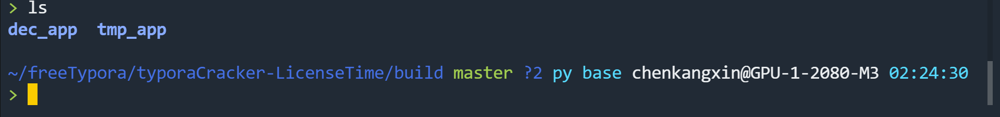

`tmp_app` 存放的是解压后的文件。

`dec_app` 存放的是解密后的文件。

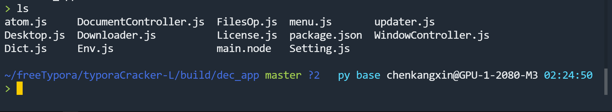

授权源码在 `License.js`.

查看源码， 可以看到， 是压缩后的 `js` 代码：

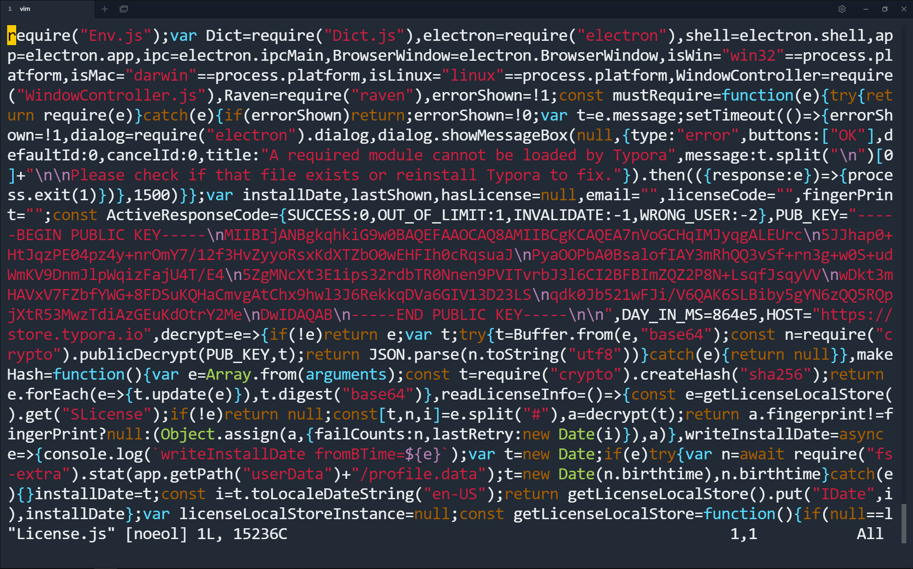

这是前端代码(`html/css/javascript`)里的常见操作， 去除空格和缩进， 变成一行。

有多种美化代码的方法， 这里不再展开。

打开 `sublime`， 安装 [`HTMLPrettify`](https://github.com/victorporof/Sublime-HTMLPrettify) 插件， 完成后， 右键， `Prettify Code` 即可。

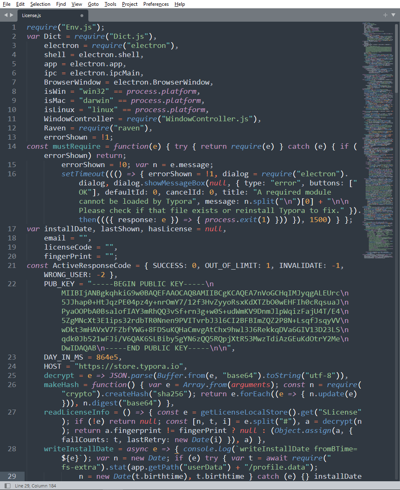

可以看到， 代码变得整洁了， 方便阅读。

源码不再细讲， 可以大致定位到 `46` 行（版本不同， 位置可能略有差异）：

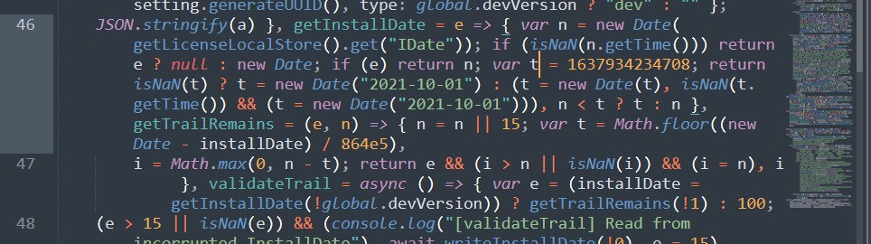

可以看到这个 `t` 的值，`1637934234708`，这是个时间戳， 表示注册时间， 也可以理解成过期时间。

具体这个时间戳代表的日期， 也可以计算出来。

这里我直接用浏览器的 `console`  简单计算一下：

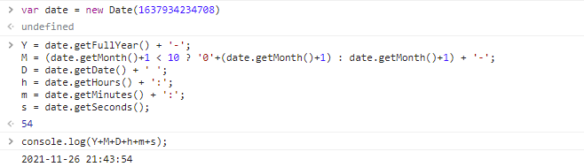

可以看到， 这个时间戳代表的是：`2021-11-26 21:43:54`

那么解决方案就很清晰了， 该文件有`4`处用到这个值， 这四处全部修改的足够大即可。如 `7964342400000`

---

#### 3.5. 保存

把 `dec_app` 文件夹放到 `TYPORA_PATH/resources` 下， 重命名成 `app` 即可。

---

#### 3.6. 一些细节

我实验了多个版本的`typora`

最新的 `typora-1.3.8` 已经修复了针对 `electron` 下的源码加固问题， 现在已经无法通过解压解密 `app.asar` 文件获得 `License.js` 了。

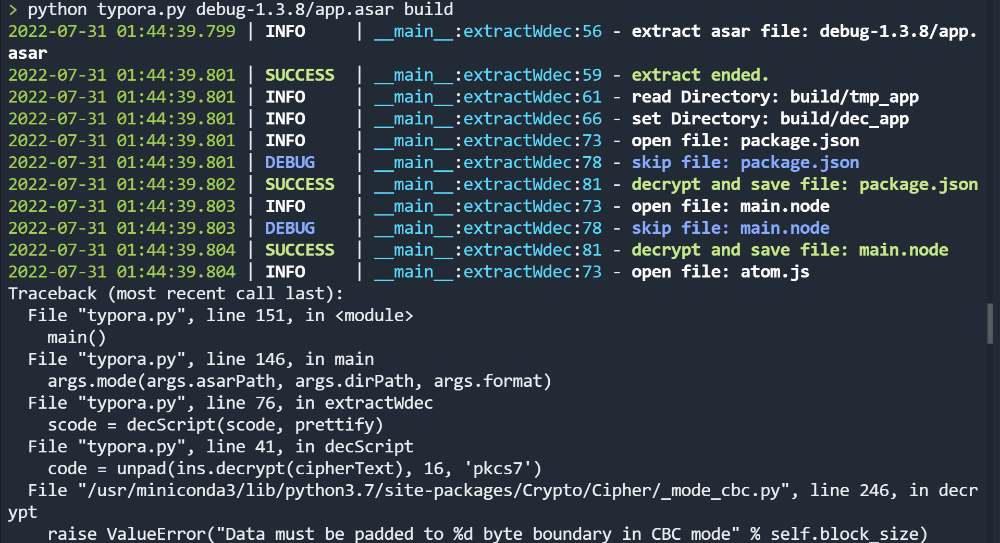

`typora-1.1.5` 也是， 虽然没有报错， 但是源码已经少了很多：

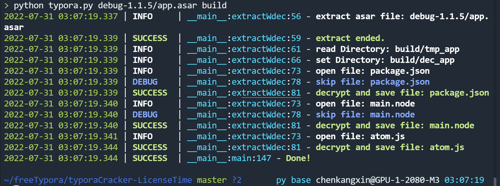

作者已经对 `typora` 的源码做了进一步的保护。

其他版本没有进一步实验， `1.0` 以前的版本用本文的方法都是有效的。

---

同时， 不同版本的 `License.js`  代码可能略有不同， 不过主逻辑都是一样的。所以没有关系。

---

本方法理论上对任意平台的 `typora` 皆有效。

---

`keygen.js` 是生成注册码， 利用 `patch + key` 的方式激活， 这似乎是 `typoraCrack` 作者自己使用的破解方式。

这里不再展开。
